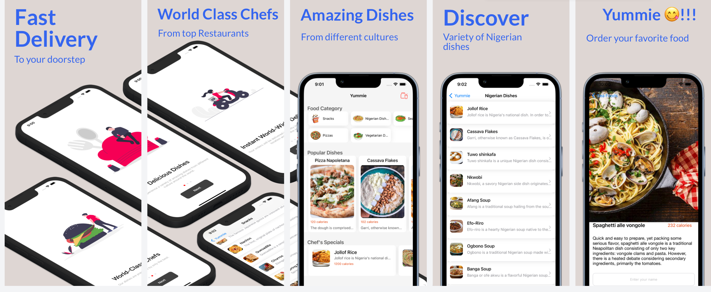

# YUMMIE, Food ordering app - **100% Programmatic UI** - No 3rd Party Library.

## Project Overview
- This project was built using UIKit components in Xcode.
- This project incorporate data from a network source by calling the `yummie.glitch.me` API. This data was parsed using JSONDecoder and appropriate error is displayed to the user whenever there is a problem fetching data from the network. 
- Data is persisted in the app using UserDefaults. 

## Requirements
- Basic proficieny with Xcode and Swift
- iOS 15
